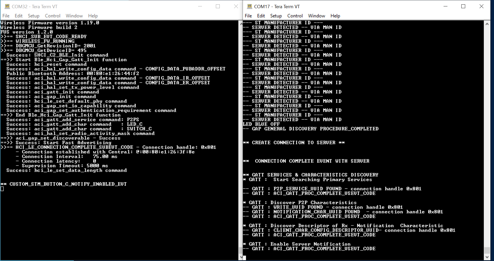

# STM32WB55_BLE_P2PClient_EXT_ATT

* The STM32WB55_BLE_P2PClient_EXT_ATT is based on the BLE_P2PClient application from CubeWB V1.19.0.
* This application is an example of the following attribute functionality:
    * Sending Regular Writes using ACI_GATT_WRITE_WITHOUT_RESP() to a BLE Server (Data Length <= 250)
    * Sending Extended Writes using ACI_ATT_PREPARE_WRITE_REQ() & ACI_ATT_EXECUTE_WRITE_REQ() to a BLE Server (Data Length <= 509 Bytes)
    * Sending Regular or Extended Read Requests using ACI_GATT_READ_CHAR_VALUE() to a BLE Server (Data Length <= 509 Bytes)
    * Receiving Regular or Extended Notifications from a BLE Server
* This application is setup to work out of the box with the STM32WB55_BLE_P2PServer_EXT_ATT example. However, it may work with other BLE Servers as well.

## Hardware Needed

  * One or Two [P-NUCLEO-WB55](https://www.st.com/en/evaluation-tools/p-nucleo-wb55.html)
    * One for STM32WB55_BLE_P2PClient_EXT_ATT
    * One for STM32WB55_BLE_P2PServer_EXT_ATT (Optional)

## Software Needed

  * Prebuilt firmware image: STM32WB55_BLE_P2PClient_EXT_ATT.hex (STM32WB55_BLE_P2PClient_EXT_ATT\Binary)

  * [STM32WB55_BLE_P2PServer_EXT_ATT]() (Optional)

  * BLE Wireless Stack from [STM32CubeWB](https://www.st.com/en/embedded-software/stm32cubewb.html) V1.19.0

  * [STM32CubeProgrammer](https://www.st.com/en/development-tools/stm32cubeprog.html)

  * IDE (Optional)

    * [STM32CubeIDE](https://www.st.com/en/development-tools/stm32cubeide.html)

    * [IAR EWARM](https://www.iar.com/products/architectures/arm/iar-embedded-workbench-for-arm/)

    * [Keil MDK-ARM](https://developer.arm.com/Tools%20and%20Software/Keil%20MDK)

  * [Tera Term](https://teratermproject.github.io/index-en.html) (Optional)

## User's Guide

1) Flash the NUCLEO-WB55 with the BLE Full Stack (stm32wb5x_BLE_Stack_full_fw).

    a) Check the [Copro Wireless Binaries Relase Notes](https://github.com/STMicroelectronics/STM32CubeWB/blob/master/Projects/STM32WB_Copro_Wireless_Binaries/STM32WB5x/Release_Notes.html) for information on the Wireless Stacks.

    b) Follow this [video](https://youtu.be/1LvfBC_P6eg) for instructions on flashing the Wireless Stack.

2) Flash the NUCLEO-WB55 with the application using one of the following methods:

    a) Flash the prebuilt firmware image with STM32CubeProgrammer.

    

    b) Build and debug the application with an IDE.

    

3) View the debug log output using Tera Term, you may need to press the reset button to view the inital logs (optional).

4) Press SW1 on the STM32WB55_BLE_P2PClient_EXT_ATT device to start scanning and automatic connection.

5) Press SW3 on the STM32WB55_BLE_P2PServer_EXT_ATT device to perform an ATT MTU exchange procedure. This is necessary for peforming extended attribute functionality. 

6) Press SW1 on the STM32WB55_BLE_P2PServer_EXT_ATT device to send a normal notification using ACI_GATT_UPDATE_CHAR_VALUE() to the STM32WB55_BLE_P2PClient_EXT_ATT device.

7) Press SW2 on the STM32WB55_BLE_P2PServer_EXT_ATT device to send a extended notification using ACI_GATT_UPDATE_CHAR_VALUE_EXT() to the STM32WB55_BLE_P2PClient_EXT_ATT device.

8) Press SW1 on the STM32WB55_BLE_P2PClient_EXT_ATT device to send a normal write using ACI_GATT_WRITE_WITHOUT_RESP() to the STM32WB55_BLE_P2PServer_EXT_ATT device.

9) Press SW2 on the STM32WB55_BLE_P2PClient_EXT_ATT device to send a extended write using ACI_ATT_PREPARE_WRITE_REQ() & ACI_ATT_EXECUTE_WRITE_REQ() to the STM32WB55_BLE_P2PServer_EXT_ATT device.

10) Press SW3 on the STM32WB55_BLE_P2PClient_EXT_ATT device to send a normal or extended read request using ACI_GATT_READ_CHAR_VALUE() to the STM32WB55_BLE_P2PServer_EXT_ATT device.

## Troubleshooting

**Caution** : Issues and the pull-requests are **not supported** to submit problems or suggestions related to the software delivered in this repository. The STM32WB55_BLE_P2PClient_EXT_ATT example is being delivered as-is, and not necessarily supported by ST.

**For any other question** related to the product, the hardware performance or characteristics, the tools, the environment, you can submit it to the **ST Community** on the STM32 MCUs related [page](https://community.st.com/s/topic/0TO0X000000BSqSWAW/stm32-mcus).